# Request to Meme 😂
This repository is an index of memes. The meme can be about anything, but it **must be workplace appropriate**. Make sure to add a link to your GitHub profile under 'submitted by' and a image source under 'source'.

## How to Contribute
Clone this repository (or open in codespace). Create an issue with a meme description you plan to add. Create a branch with the issue number, your initials and a brief description (something like this "1-ih-add-cat-meme"). Add your meme, commit, push branch, and create a pull request into main branch. Pull requests must have at least 2 approvals before being merged. Link the pull request using [closing keywords](https://docs.github.com/en/issues/tracking-your-work-with-issues/linking-a-pull-request-to-an-issue) to associate the pull request with your issue. Do not commit directly to main!

## Memes

| Meme | Submitted By | Source |
| -------- | ------- | ------- |
|  | [Ian Heraty](https://github.com/heratyian) | [source](https://wallpapers.com/images/featured-full/cat-meme-pictures-9anza1hu2l2k0wyp.jpg) |
| 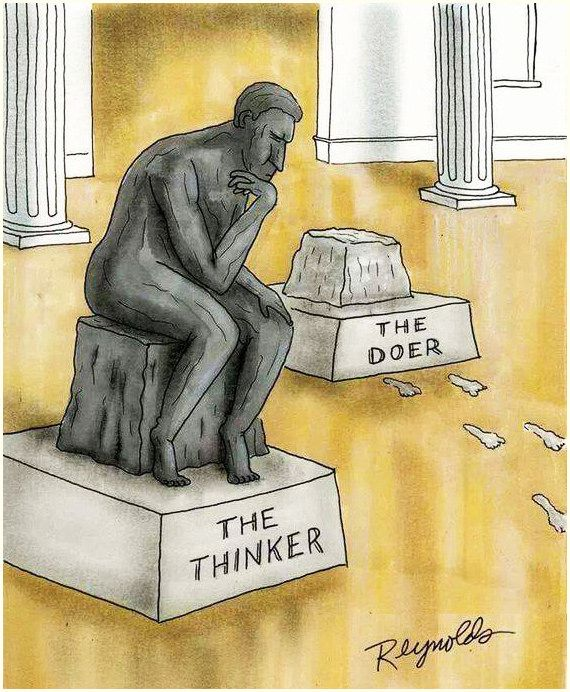 | [Brian Waddell](https://github.com/Brian-Waddell) | [source](https://scontent-ord5-2.xx.fbcdn.net/v/t39.30808-6/278198975_3069239186721300_8146581222467992731_n.jpg?_nc_cat=104&ccb=1-7&_nc_sid=5f2048&_nc_ohc=kJ-BD7YozQwAX9udrWB&_nc_ht=scontent-ord5-2.xx&oh=00_AfDBefafzBfNjg6qUA1gAL0LyRviO4bRgUg4AUqf1pkkrA&oe=653D8F44) |
|  | [Mena Castillo](https://github.com/Meenoow) | [source](https://medium.com/agileactors/program-memes-45f69695457e) |
| 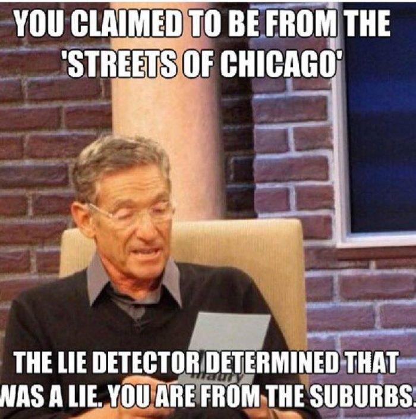 | [RJ](https://github.com/RJDPI) | [source](https://img-aws.ehowcdn.com/700x/cdn.onlyinyourstate.com/wp-content/uploads/2018/02/Facebook_Chicago-Memes12-700x704.jpg) | 
|  | [Ian Heraty](https://github.com/heratyian) | [source](https://twitter.com/daboigbae/status/1698017944478130210?s=12)
|  | [Thierry Chau](https://github.com/thierrychau) | [source](https://sm.mashable.com/t/mashable_sea/photo/default/2_6n5e.2496.png) |
| 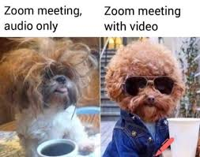 | [Alina Sapronova](https://github.com/AlinaSapronova) | [source](https://bascomtelephone.com/community/latest-news/best-tech-memes-2020/) |
| 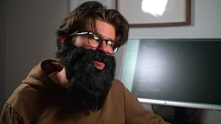 | [Sam Lubliner](https://github.com/Samuel-Lubliner) | [source](https://www.youtube.com/watch?v=Uo3cL4nrGOk) |
|  | [David Hibble](https://github.com/hibbleD) | [source](https://www.happierhuman.com/funny-memes-work-stress/) |
| 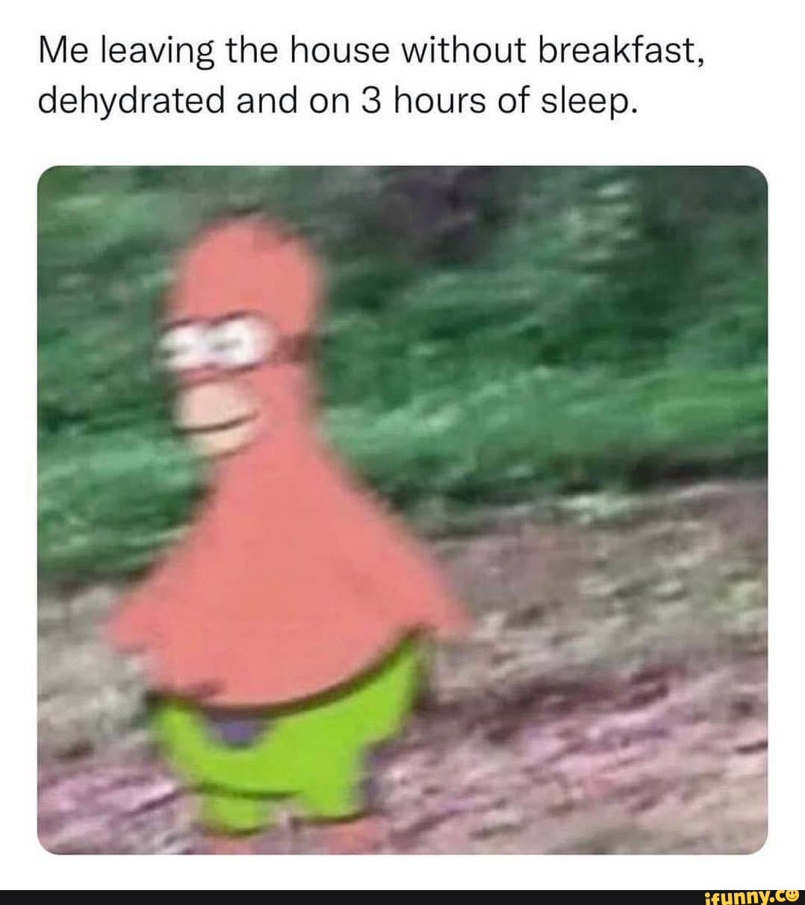 | [Andre Garner](https://github.com/ajgarner98) | [source](https://imgb.ifunny.co/images/0667ce7b82216c72216e82e5946a1fed0b452a2ffe5893eee84737c29d2dd079_1.jpg) |
|  | [Jason Ho](https://github.com/jasonho404) | [source](https://www.pinterest.com/pin/found-on-americas-best-pics-and-videos--782430135277693078/) |
|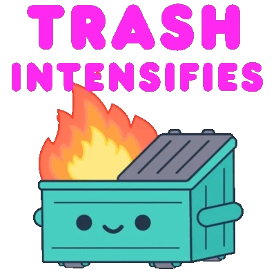| [Jacob Hoffmann](https://github.com/jacobhoffmann257) | [source](https://media4.giphy.com/media/v1.Y2lkPTc5MGI3NjExa25zcTlocTdpdTNvc3hubHk3enJuOG51Zmh1dHoweGpuYXZpZ3psbSZlcD12MV9pbnRlcm5hbF9naWZfYnlfaWQmY3Q9cw/giLKqcYUzgoUe9tioR/giphy.gif)
| | [Andrew Cook](https://github.com/andrewhcook) | [source](https://media.makeameme.org/created/one-does-not-zjxkyt.jpg) |
| 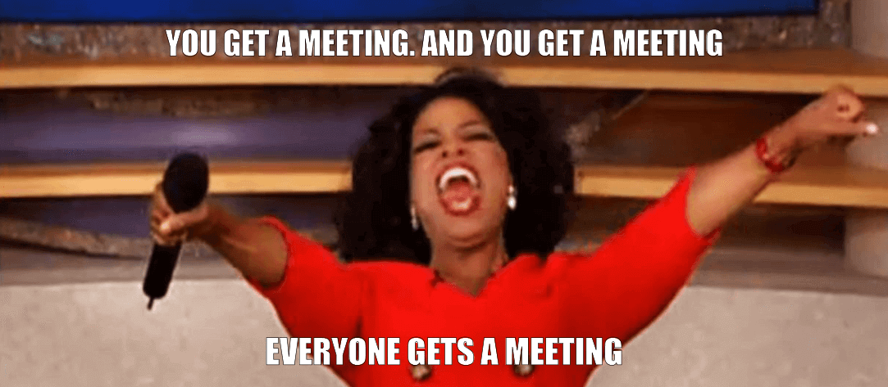 | [Alex Mompremier](https://github.com/ajmompr) | [source](https://www.ntaskmanager.com/wp-content/uploads/2018/03/Oprah-meetings-meme-1.png) |
| 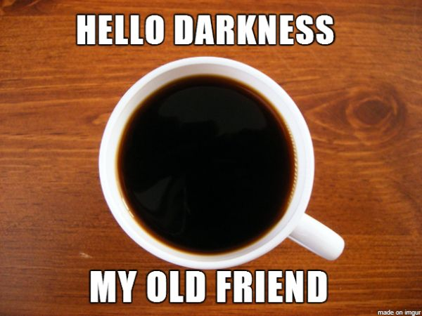 | [Fidel Leal](https://github.com/fidel-techprep) | [source](https://i0.wp.com/roomescapeartist.com/wp-content/uploads/2016/07/coffee-meme-hello-darkness-my-old-friend.jpg?ssl%253D1) |
| 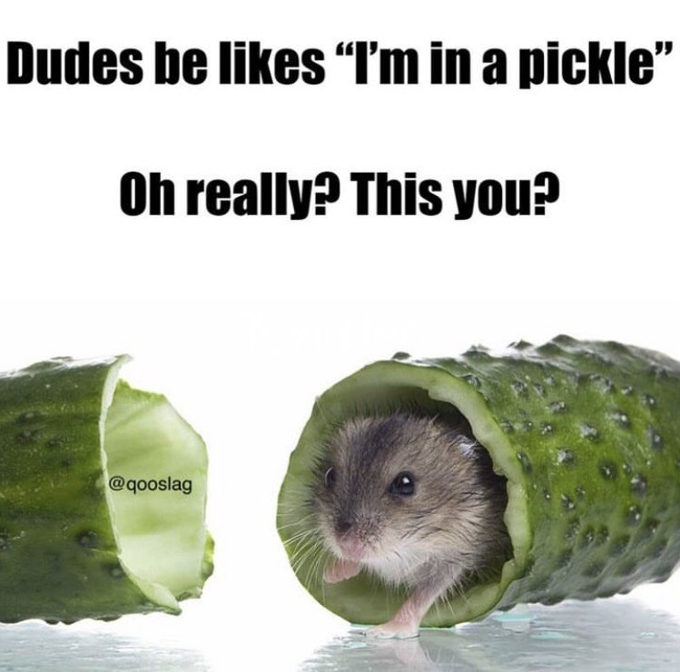 | [Aldo Portillo](https://github.com/aldoportillo) | [source](https://pbs.twimg.com/media/FsXbMgoWcAAut83.jpg) |
|  | [Sara Schoonover](https://github.com/saraschoonover) | [source](https://media.sproutsocial.com/uploads/meme-example.jpg) |
|  | [Brenda Reyes](https://github.com/brendareyes-techprep) | [source](https://www.reddit.com/r/ProgrammerHumor/comments/ayvwjo/confused_screaming/) | 
|  | [Carlos Castaneda](https://github.com/CarlosCastanedaDev) | [source](https://images.app.goo.gl/iQ7RNtfAMFb4x5yB6) |
|  | [Jared Bears](https://github.com/JaredBears) | [source](https://www.instagram.com/p/CMfOcLEh6ff/) |
|  | [Jun So](https://github.com/thatcantbeso) | [source](https://twitter.com/KennethCassel/status/1710048342535753795) |
|  | [Kat Jarboe](https://github.com/melo616) | [source](https://knowyourmeme.com/photos/1439882-coughing-cat) |
|  | [Thierry Chau](https://github.com/thierrychau) | [source](https://sm.mashable.com/t/mashable_sea/photo/default/2_6n5e.2496.png) |
| 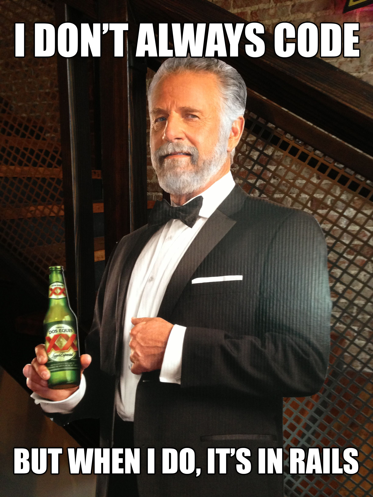 | [Jorge Pioquinto](https://github.com/Jorge-Pioquinto) | [source](https://i.pinimg.com/originals/f6/9b/76/f69b76501091fa5fb0e026a6a23ecbbe.jpg) |
| 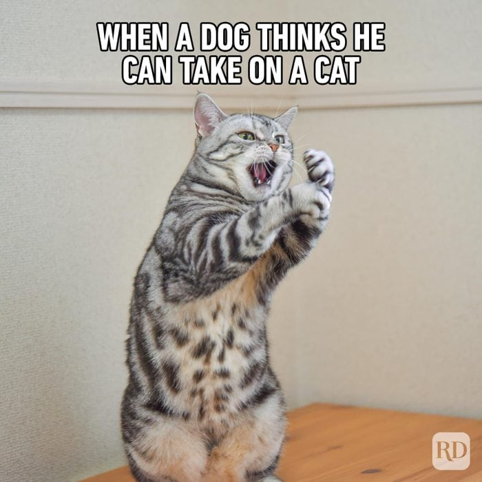 | [Akin Campbell](https://github.com/akincampbell) | [source](https://www.rd.com/wp-content/uploads/2023/04/Hilarious-Cat-Memes-2.jpg?fit=700%2C700?fit=700,700) |
|  | [Calvin Armstrong](https://github.com/armstrca) | [source](https://i.ibb.co/hszQB7G/Screenshot-20231025-134628-2.png) |
|  | [Chierry Thau](https://github.com/armstrca) | [source](https://dashboard.dpi.dev/cohorts/126be8e2-7a8d-4725-8509-d6e8a48dbbe8/enrollments/2713d7ec-cd2a-4bc0-bc47-469cd4d567cc/snapshot) |
|  | [Carman Chiu](https://github.com/chiucarman) | [Source](https://imgflip.com/i/6n6qu2) |
| 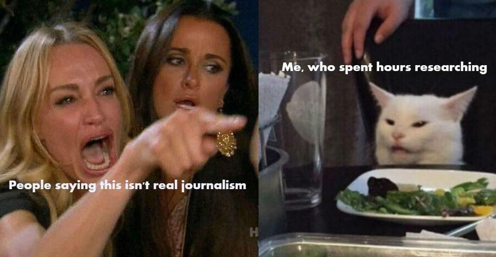 | [Dmitrii Sumenko](https://github.com/flstudio4) | [source](https://www.newshub.co.nz/home/lifestyle/2019/08/the-top-five-cat-memes-of-all-time-rated.html) |
| 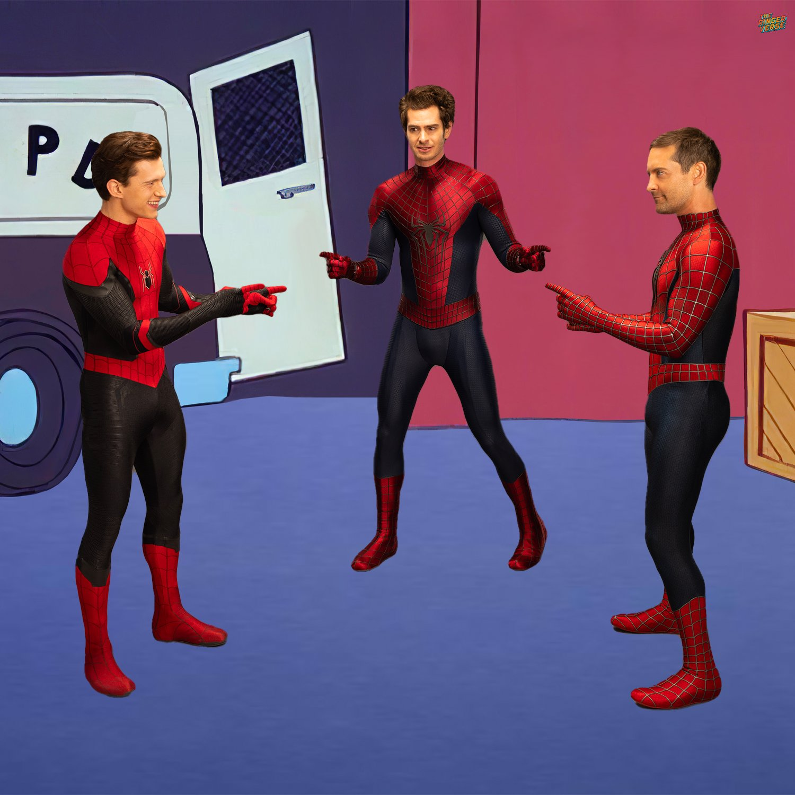 | [Alejandro Lopez](https://github.com/alejlopez139) | [source](https://pbs.twimg.com/media/FMTJZP4VgAEWxxr?format=jpg&name=large)
|  | [Chierry Thau](https://github.com/armstrca) | [source](https://dashboard.dpi.dev/cohorts/126be8e2-7a8d-4725-8509-d6e8a48dbbe8/enrollments/2713d7ec-cd2a-4bc0-bc47-469cd4d567cc/snapshot) |
|  | [Ethan Huang](https://github.com/EthanKH) | [source](https://uploads-ssl.webflow.com/5f3c19f18169b62a0d0bf387/60d33be7eedf8e1f31aabcec_BwENfmI0CU5dZGYlSyo142mpfG08-rYgTS-Qm47uMUXN6JXtmdZvtzVzTooUQdXTWmTD8uzF9N6XQJA2vUIMi53tunFyVtvOBJTNfOjHit2P_JkTmFzFsK7ep6Vb9781XZnRAryH.png) |
