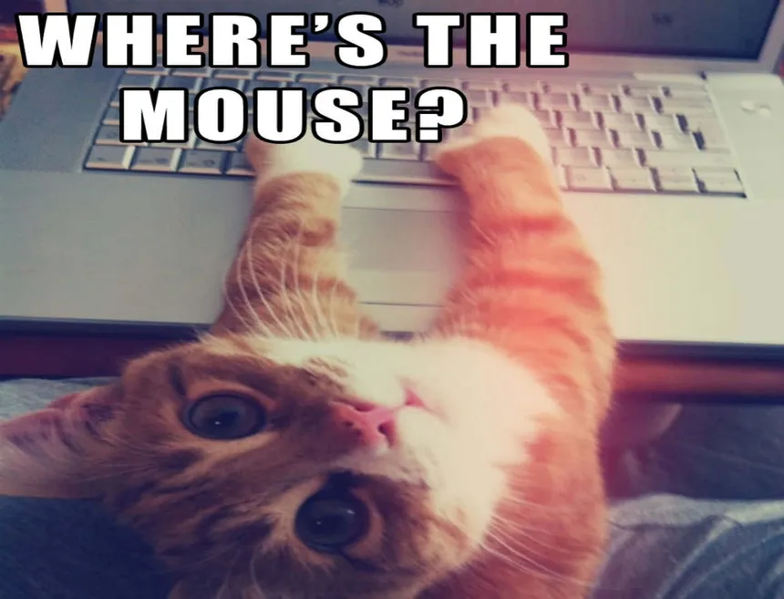
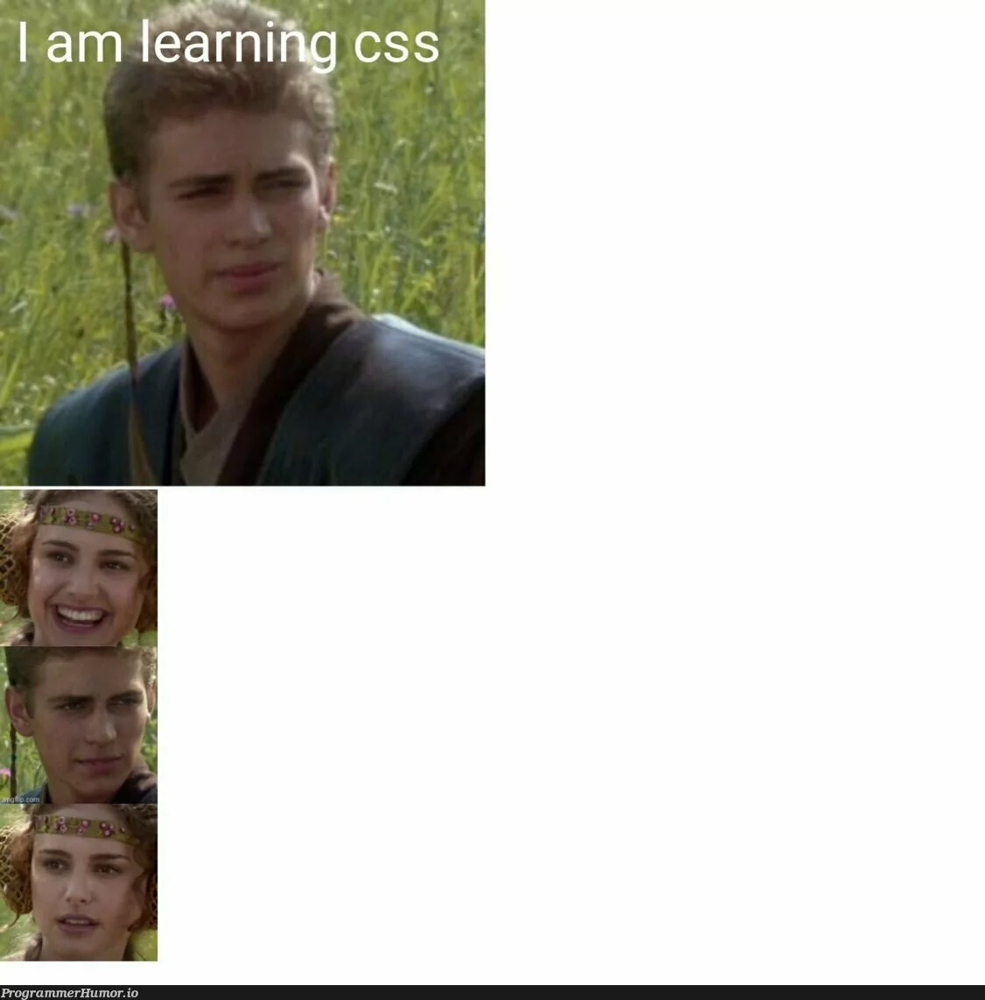

# Request to Meme 😂
This repository is an index of memes. The meme can be about anything, but it **must be workplace appropriate**. Make sure to add a link to your GitHub profile under 'submitted by' and a image source under 'source'.

## How to Contribute
Clone this repository (or open in codespace). Create an issue with a meme description you plan to add. Create a branch with the issue number, your initials and a brief description (something like this "1-ih-add-cat-meme"). Add your meme, commit, push branch, and create a pull request into main branch. Pull requests must have at least 2 approvals before being merged. Link the pull request using [closing keywords](https://docs.github.com/en/issues/tracking-your-work-with-issues/linking-a-pull-request-to-an-issue) to associate the pull request with your issue. Do not commit directly to main!

## Memes

| Meme | Submitted By | Source |
| -------- | ------- | ------- |
|  | [Ian Heraty](https://github.com/heratyian) | [source](https://wallpapers.com/images/featured-full/cat-meme-pictures-9anza1hu2l2k0wyp.jpg) |
|  | [Mena Castillo](https://github.com/Meenoow) | [source](https://medium.com/agileactors/program-memes-45f69695457e) |
|  | [Carlos Castaneda](https://github.com/CarlosCastanedaDev) | [source](https://images.app.goo.gl/iQ7RNtfAMFb4x5yB6)
